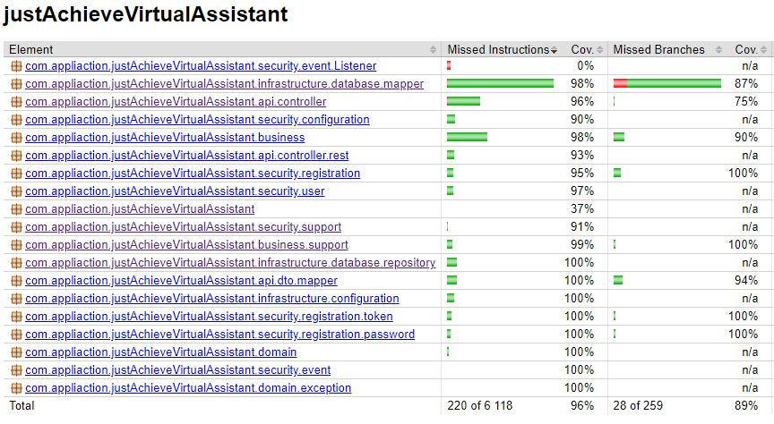

<h1 align="center">
   
  
   
  justAchieve! Virtual Assistant
   
</h1>

## 📌 Table of content

- [Project Description](#project-description)
- [Problem Solved](#problem-solved)
- [Main Features](#main-features)
- [Tests](#tests)
- [Technology Stack](#technology-stack)

## 🏋️ Project Description
**justAchieve! Virtual Assistant** is a fitness app that was created for people who want to lead a healthy lifestyle and achieve their diet and physical activity goals. The app aims to support users in their daily fit life by providing them with tools, information and motivation.
## 📝 Problem Solved
**justAchieve! Virtual Assistant** was created to solve the problem of lack of support and orientation in the world of dieting and maintaining a healthy lifestyle. Often people starting a diet do not know how to calculate their caloric needs, what their macronutrient needs are or how to compose appropriate meals. In addition, maintaining motivation and regularity in workouts is often a challenge for many people. The justAchieve! Virtual Assistant provides tools and tips that allow users to get started on their diet, tailor it to their goals, and maintain a healthy lifestyle for the long term.
## 🎯 Main Features

- Calculation of body mass index (BMI)
- Calculation of basal metabolic rate (BMR)
- Calculation of macronutrient requirements
- Access to tips and advice on healthy eating, training and motivation tailored to the user's selected dietary goal
- Ability to track calories, macronutrients and micronutrients consumed by searching and recording foods and meals consumed
- Internal profile personalization, including dietary goals and profile pictures
- Ability to track your own body measurements by adding, reading and editing body measurements

## ✔️ Tests
In the **justAchieve! Virtual Assistant** tests play an important role, as they are the foundation of security and code quality. Thanks to testing, the application can be better protected from bugs and provide reliable performance.

Test coverage in the application is at 96%, which means that almost all code is covered by testing. This gives us the confidence that every line of code is checked for correct operation.

We used different approaches and tools to write the tests. For unit testing, the Mockito library was used. For integration testing, tools such as DataJpaTest, WebMvcTest and SpringBootTest. In addition, RestAssured and Wiremock to test behavior and integration with external services and APIs.

<h1 align="center">
  
</h1>

## 📚 Technology Stack

**♢ Core:**
- Spring Boot
- REST
- Docker
- Gradle
- Lombok
- Slf4j
- SpringDoc OpenApi

**♢ DB:**
- PostgreSQL
- Flyway
- Hibernate
- Spring Data Jpa

**♢ Security:**
- Spring Security
- Spring Mail
- Jasypt

**♢ Tests:**
- JUnit Jupiter
- Mockito
- REST Assured
- Wiremock

**♢ View:**
- HTML, CSS
- Thymeleaf
- Bootstrap

**♢ Other:**
- Mapstruct
- PlantUML
- and more..