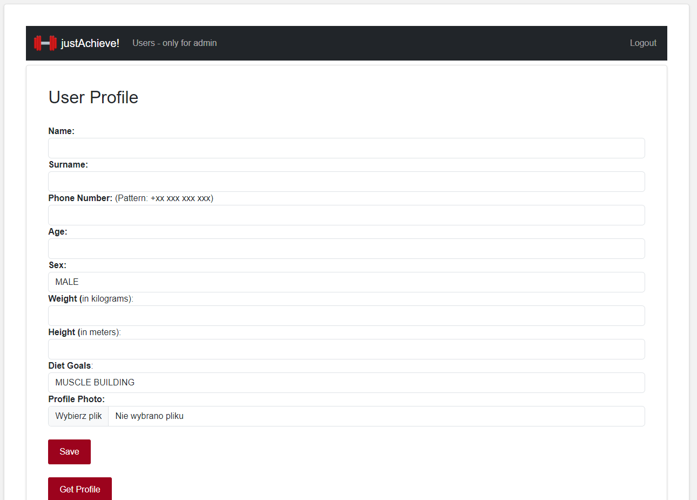
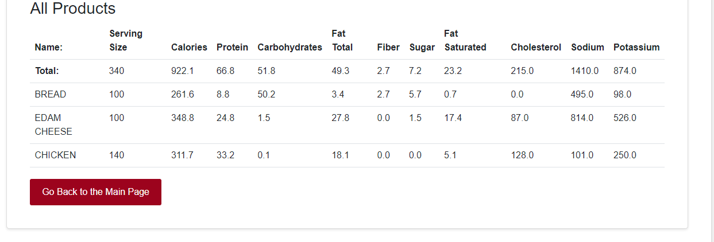

<h1 align="center">
  <br>
  <a></a>
  <br>
  justAchieve! Virtual Assistant
  <br>
</h1>

## 📌 Table of Content

* [🏋️ Project Description](#-project-description)
* [📝 Problem Solved](#-problem-solved)
* [🎯 Main Features](#-main-features)
* [✔️ Tests](#-tests)
* [📚 Technology Stack](#-technology-stack)
* [💾 Usage](#-usage)
* [🧾 Entity Relationship Diagram](#-entity-relationship-diagram)
* [👀 Screenshots](#-screenshots)
* [📆 Future Plans](#-future-plans)


## 🏋️ Project Description
**justAchieve! Virtual Assistant** is a fitness app that was created for people who want to lead a healthy lifestyle and achieve their diet and physical activity goals. The app aims to support users in their daily fit life by providing them with tools, information and motivation.
## 📝 Problem Solved
**justAchieve! Virtual Assistant** was created to solve the problem of lack of support and orientation in the world of dieting and maintaining a healthy lifestyle. Often people starting a diet do not know how to calculate their caloric needs, what their macronutrient needs are or how to compose appropriate meals. In addition, maintaining motivation and regularity in workouts is often a challenge for many people. The justAchieve! Virtual Assistant provides tools and tips that allow users to get started on their diet, tailor it to their goals, and maintain a healthy lifestyle for the long term.
## 🎯 Main Features

- Calculation of body mass index (BMI)
- Calculation of basal metabolic rate (BMR)
- Calculation of macronutrient requirements
- Access to tips and advice on healthy eating, training and motivation tailored to the user's selected dietary goal
- Ability to track calories, macronutrients and micronutrients consumed by searching and recording foods and meals consumed
- Internal profile personalization, including dietary goals and profile pictures
- Ability to track your own body measurements by adding, reading and editing body measurements

Note: The above-mentioned functionalities are available after registration and confirmation of the account by e-mail. In addition, the function of deleting/editing registered users is only available from an administrator account. You can log in as an administrator with the following credentials:
- Username: admin
- Password: admin

## ✔️ Tests
In the **justAchieve! Virtual Assistant** tests play an important role, as they are the foundation of security and code quality. Thanks to testing, the application can be better protected from bugs and provide reliable performance.

Different approaches and tools were used to write the tests. For unit testing, the Mockito library was used. For integration testing, tools such as DataJpaTest, WebMvcTest and SpringBootTest. In addition, RestAssured and Wiremock to test behavior and integration with external services and APIs.

Lombok has been configured to add the @Generated annotation to its generated code, which eliminates the need to test each getter, setter, etc., individually. This enhancement streamlines the testing process and ensures the reliability of the generated code.

To generate a code coverage report, the JaCoCo Java Code Coverage Library was used. The code coverage is: 95%/90% (Instructions/Branches) which is presented below.

<h1 align="center">
  <a></a>
</h1>

A large part of the tests are simple mapping tests of the MapStruct Library. Excluding the code generated by MapStruct, code coverage with tests is at the level presented below:

<h1 align="center">
  <a></a>
</h1>

## 📚 Technology Stack

**♢ Core:**
- Spring Boot
- REST
- Docker
- Gradle
- Lombok
- Slf4j
- SpringDoc OpenApi


**♢ DB:**
- PostgreSQL
- Flyway
- Hibernate
- Spring Data Jpa

**♢ Security:**
- Spring Security
- Spring Mail
- Jasypt

**♢ Tests:**
- JUnit Jupiter
- Mockito
- REST Assured
- Wiremock

**♢ View:**
- HTML, CSS
- Thymeleaf
- Bootstrap

**♢ Other:**
- MapStruct
- PlantUML
- and more..

## 💾 Usage

The easiest way (besides the traditional application launch) is to use Docker Compose. 

1. Clone the repository:
``` 
$ git clone https://github.com/xGabrjel/just-achieve-virtual-assistant.git
```
2. Start the Docker Compose:
```
$ docker compose up
```
3. Access the application at:
```
localhost:2504/justAchieveVirtualAssistant
```
4. Register in the app, complete your user profile, and start using the application!


5. Explore the Swagger UI for API documentation:
```
http://localhost:2504/justAchieveVirtualAssistant/swagger-ui/index.html
```
## 🧾 Entity Relationship Diagram

<h1 align="center">
  <a></a>
</h1>

## 👀 Screenshots

<b>Worth noting:</b> 
The visual layer of the application is created using basic technologies such as HTML, CSS, and Thymeleaf. Given that my primary focus is on mastering backend development, the frontend visual layer is designed to prioritize the optimal presentation of the application's functionalities rather than solely aesthetic appeal.
The application exposes its REST API, enabling the invocation of GET, POST, PUT, and DELETE endpoints.
```
Available endpoints:
```
<h1 align="center">
  <a></a>
</h1>

```
Screenshot from the application:
```

<h1 align="center">
  <a></a>
</h1>

<h1 align="center">
  <a></a>
</h1>

<h1 align="center">
  <a></a>
</h1>

<h1 align="center">
  <a></a>
</h1>

<h1 align="center">
  <a></a>
</h1>

<h1 align="center">
  <a></a>
</h1>

<h1 align="center">
  <a></a>
</h1>

<h1 align="center">
  <a></a>
</h1>

<h1 align="center">
  <a></a>
</h1>

<h1 align="center">
  <a></a>
</h1>

<h1 align="center">
  <a></a>
</h1>

<h1 align="center">
  <a></a>
</h1>

<h1 align="center">
  <a></a>
</h1>

<h1 align="center">
  <a></a>
</h1>

<h1 align="center">
  <a></a>
</h1>

<h1 align="center">
  <a></a>
</h1>

<h1 align="center">
  <a></a>
</h1>

<h1 align="center">
  <a></a>
</h1>

<h1 align="center">
  <a></a>
</h1>

<h1 align="center">
  <a></a>
</h1>

<h1 align="center">
  <a></a>
</h1>

## 📆 Future Plans
- Adding new functionalities such as intermittent fasting (IF) counter
- Improving visual layer